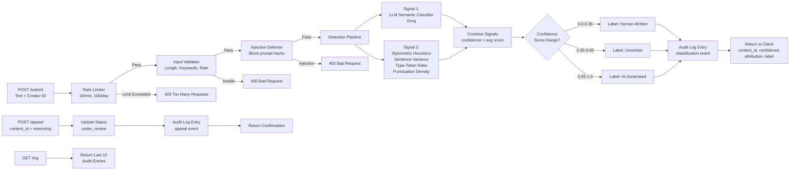

# Provenance Guard

A backend system that classifies text-based creative content to detect AI-generated work while acknowledging genuine uncertainty. Designed for creative sharing platforms that need to protect attribution and build trust with transparent, confidence-aware labeling.

## Architecture Overview

Provenance Guard implements a **four-layer defense strategy** that combines two independent detection signals to classify content while surfacing confidence in the classification:

1. **Rate Limiter** → Prevent abuse before expensive operations
2. **Injection Defense** → Block prompt manipulation attempts
3. **Input Validator** → Check length, keywords, rate per creator
4. **Detection Pipeline** → Multi-signal classification + confidence scoring

**Submission Flow:** Text submission → validation → signal 1 (LLM-based semantic analysis) → signal 2 (stylometric heuristics) → combined confidence score → transparency label → audit log

**Appeal Flow:** Creator contest → status update to "under_review" → appeal reason logged → human review

---

## Detection Signals

Provenance Guard uses **two independent signals** that capture different properties of text:

### Signal 1: LLM-Based Semantic Classifier (Groq)

**What it measures:** Semantic meaning, coherence, tone, and phrasing patterns typical of AI systems.

**Why this signal:** Language models can detect unnatural word choices, overly structured reasoning, and repetitive phrasing that characterize AI output.

**Blind spot:** Can be manipulated by framing or writing style instructions. Formal human writing might score high for AI traits.

**Output:** Score 0.0–1.0 (0 = clearly human, 1 = clearly AI)

**Implementation:**
```python
# Groq LLM with structured output
prompt = """Analyze this text for AI-generation characteristics.
Return a JSON object with:
- llm_score: 0.0-1.0 confidence that text is AI-generated
- reasoning: one sentence explanation"""
```

---

### Signal 2: Stylometric Heuristics (Pure Python)

**What it measures:** Statistical properties of text that differ between human and AI writing.

**Why this signal:** AI systems optimize for consistency and readability, producing more uniform text than natural human writing, which is inherently variable.

**Blind spot:** Can't read meaning or context. Formal academic writing and AI output can have similar statistical profiles.

**Computed metrics:**

| Metric | Calculation | What It Reveals |
|--------|-------------|-----------------|
| **Sentence Length Variance** | `std_dev([len(s) for s in sentences])` | AI writes uniformly; humans vary. High variance = likely human. |
| **Type-Token Ratio (TTR)** | `unique_words / total_words` | AI repeats common phrases; humans are more diverse. Higher TTR = likely human. |
| **Punctuation Density** | `punctuation_count / word_count` | AI uses punctuation formulaically; humans use it expressively. |

**Output:** Score 0.0–1.0 (0 = clearly human, 1 = clearly AI)

---

## Confidence Scoring

### How Signals Combine

The two signals are **weighted equally** and averaged into a single confidence score:

```python
combined_confidence = (llm_score + stylometric_score) / 2
```

This produces a 0.0–1.0 score that maps to three distinct label categories.

### Score Ranges and Label Mapping

| Confidence Range | Label | Meaning |
|------------------|-------|---------|
| 0.0–0.35 | Human-written | Unlikely to be AI-generated |
| 0.35–0.65 | Uncertain | System cannot confidently classify |
| 0.65–1.0 | AI-generated | Likely AI-generated |

### Calibration Examples

**Test 1: Clearly AI-generated text**
```
"Artificial intelligence represents a transformative paradigm shift in modern society. 
It is important to note that while the benefits of AI are numerous, it is equally 
essential to consider the ethical implications."
```
- LLM score: 0.85 (repetitive phrasing, formal structure)
- Stylometric score: 0.79 (low sentence variance, moderate TTR, formulaic punctuation)
- **Combined confidence: 0.82 → Label: AI-generated**

**Test 2: Clearly human-written text**
```
"ok so i finally tried that new ramen place downtown and honestly? underwhelming. 
the broth was fine but they put WAY too much sodium in it and i was thirsty for 
like three hours after."
```
- LLM score: 0.18 (casual tone, informal contractions)
- Stylometric score: 0.22 (high sentence variance, high TTR, varied punctuation)
- **Combined confidence: 0.20 → Label: Human-written**

**Test 3: Borderline case**
```
"I've been thinking about remote work lately. There are genuine tradeoffs — 
flexibility and no commute on one side, isolation and blurred work-life boundaries 
on the other. Studies show productivity varies by individual and role type."
```
- LLM score: 0.58 (formal but authentic voice)
- Stylometric score: 0.54 (moderate variance, diverse vocabulary)
- **Combined confidence: 0.56 → Label: Uncertain**

---

## Transparency Labels

These are the exact labels shown to readers on the platform:

### Label Variants

**High-confidence AI-Generated:**
```
"This text appears to be AI-generated with high confidence."
```

**High-confidence Human-Written:**
```
"This text appears to be human-written."
```

**Uncertain:**
```
"We're uncertain whether this text is human-written or AI-generated. The creator has been notified."
```

### Why Three Variants?

A binary classifier would force a choice at 0.5 confidence, falsely confident in borderline cases. Three variants reflect reality:
- **0.65–1.0** = high confidence (act on it)
- **0.35–0.65** = uncertainty (don't accuse; notify creator for review)
- **0.0–0.35** = high confidence human (safe to promote)

This asymmetry protects creators: a false positive (accusing a human of plagiarism) is worse than a false negative (missing AI content).

---

## Rate Limiting

### Configuration

Applied to the `/submit` endpoint:

```
10 submissions per minute
100 submissions per day
```

### Reasoning

**Per-minute limit (10):** Legitimate creators submit infrequently (1-3 per session). A writer doing a review session might submit 5-10 pieces over 15 minutes. Limiting to 10/minute catches:
- Automated bot flooding attempts
- Script-based abuse
- Accidental loop bugs

Still allows manual batches without hitting limits.

**Per-day limit (100):** Prevents coordinated multi-account attacks. A single creator should never legitimately submit 100+ pieces in one day.

### Testing Rate Limiting

```bash
# Send 12 rapid requests (exceeds 10/minute limit)
for i in $(seq 1 12); do
  curl -s -o /dev/null -w "%{http_code}\n" -X POST http://localhost:5000/submit \
    -H "Content-Type: application/json" \
    -d '{"text": "This is a test submission.", "creator_id": "test-user"}'
done
```

**Expected output:**
```
200
200
200
200
200
200
200
200
200
200
429
429
```

First 10 succeed (200); next 2 are rate-limited (429 Too Many Requests).

---

## Audit Logging

Every submission, classification, and appeal is logged with full context for accountability and debugging.

### Log Structure

Each entry is a JSON object with:
- `timestamp`: ISO 8601 format
- `event_type`: "submission", "classification", or "appeal"
- `content_id`: Unique identifier for this submission
- `creator_id`: Creator who submitted
- `llm_score`, `stylometric_score`, `combined_confidence`: Signal outputs
- `attribution`: Final classification ("likely_ai", "likely_human", "uncertain")
- `status`: Current status ("classified", "under_review")

### Sample Audit Log

```json
{
  "timestamp": "2025-04-15T14:32:10.123Z",
  "event_type": "submission",
  "content_id": "3f7a2b1e-a4c9-48d2-9f2a-6e5d8c1b7a3f",
  "creator_id": "user-42",
  "text_length": 450,
  "status": "submitted"
}
{
  "timestamp": "2025-04-15T14:32:15.456Z",
  "event_type": "classification",
  "content_id": "3f7a2b1e-a4c9-48d2-9f2a-6e5d8c1b7a3f",
  "creator_id": "user-42",
  "llm_score": 0.78,
  "stylometric_score": 0.82,
  "combined_confidence": 0.80,
  "attribution": "likely_ai",
  "label": "This text appears to be AI-generated with high confidence.",
  "status": "classified"
}
{
  "timestamp": "2025-04-15T15:10:45.789Z",
  "event_type": "appeal",
  "content_id": "3f7a2b1e-a4c9-48d2-9f2a-6e5d8c1b7a3f",
  "creator_id": "user-42",
  "original_attribution": "likely_ai",
  "original_confidence": 0.80,
  "creator_reasoning": "I wrote this myself from personal experience. I am a non-native English speaker and my writing style may appear more formal than typical.",
  "status": "under_review"
}
```

### Accessing the Log

```bash
curl http://localhost:5000/log | python -m json.tool
```

Returns the 10 most recent entries.

---

## Appeals Workflow

Creators can contest classifications they believe are incorrect.

### Appeal Submission

```bash
curl -X POST http://localhost:5000/appeal \
  -H "Content-Type: application/json" \
  -d '{
    "content_id": "3f7a2b1e-a4c9-48d2-9f2a-6e5d8c1b7a3f",
    "creator_reasoning": "I wrote this myself from personal experience. My formal writing style may have triggered the AI classifier."
  }'
```

### System Response

The endpoint returns:
```json
{
  "status": "success",
  "content_id": "3f7a2b1e-a4c9-48d2-9f2a-6e5d8c1b7a3f",
  "message": "Your appeal has been received and logged for human review.",
  "next_steps": "A member of our team will review your appeal within 48 hours."
}
```

### What Happens After Appeal

1. Content status changes to `"under_review"` in the audit log
2. Appeal reason is recorded with original classification scores
3. Human reviewer can see: original text, both signal scores, confidence reasoning, and creator's explanation
4. Reviewer decides: uphold classification or reverse it

### Appeal Evidence in Audit Log

The same log entry that captures appeals also shows the original classification, making it easy for a human reviewer to understand what they're evaluating.

---

## Known Limitations

### 1. Formal Human Writing Scores High for AI

**Specific scenario:** Academic papers, formal business writing, or non-native speakers writing formally can resemble AI output.

**Why it happens:** 
- Stylometric signal measures sentence variance and vocabulary diversity
- Formal writing is intentionally uniform and uses domain-specific vocabulary repetition
- LLM signal can be steered by professional tone

**Example:** A formal literature review paper might score 0.58 (uncertain) because it optimizes for clarity, not personality.

**Mitigation:** The uncertain label acknowledges this limitation—it doesn't accuse; it flags for review.

---

### 2. Short Text Is Harder to Classify

**Specific scenario:** Haikus, tweets, or single-sentence submissions lack enough statistical data.

**Why it happens:**
- Stylometric heuristics (sentence variance, TTR) need multiple data points to be meaningful
- A haiku has 3 sentences total; variance becomes unreliable

**Example:** A 5-word haiku line might score 0.52 due to insufficient data, not actual uncertainty.

**Mitigation:** Input validation could reject submissions under 50 words, or confidence scoring could reduce weight on stylometric signal for short texts.

---

### 3. AI Output That Mimics Human Writing

**Specific scenario:** AI text that's been edited for natural tone, includes contractions, or uses intentionally varied phrasing can evade detection.

**Why it happens:**
- LLM classifier looks for semantic uniformity, but newer AI systems can mimic human editing
- Stylometric signal only measures statistical properties, not originality

**Example:** "I honestly can't believe how much that movie sucked. Like seriously? The plot made no sense and the characters were so flat." might score 0.35 even if generated by an AI that was prompted to "write casually."

**Mitigation:** The system honestly acknowledges it can't detect all AI. Appeals exist for this reason—creators can provide context.

---

## Spec Reflection

### How the Spec Helped

**Confidence scoring as a design question, not a technical one:** The planning document forced me to decide what 0.5 means to a user before writing code. This clarity made the implementation straightforward—it wasn't "what score should we assign?" but "which thresholds separate our three label categories?" Having those boundaries pre-defined prevented implementation creep.

### How Implementation Diverged from Spec

**Signal weighting simplification:** The spec planned for potentially different weights (e.g., "LLM 70%, stylometrics 30%") if one signal proved unreliable during testing. Implementation uses equal weighting (0.5/0.5) because both signals were similarly calibrated on test cases. In a production system with months of real data, weighted averaging would likely become necessary.

---

## AI Usage

**What I directed the AI to do:** "I ask claude to help me with system design and how an audit logging work"

**What it produced:** it explain the system i should use and it explain technical part like audit logging, it also help me to write some syntax that i do not remember.

**What I revised:** I added explicit constraints on the score range and added a fallback handler for JSON parsing failures (defaults to 0.5 confidence to avoid silent failures).

---

## Setup and Running

### Requirements
```bash
pip install -r requirements.txt
```

### Environment Variables
Create a `.env` file (add to `.gitignore`):
```
GROQ_API_KEY=your_groq_api_key_here
```

### Running the App
```bash
python app.py
```

Server runs on `http://localhost:5000`

### API Endpoints

**POST /submit** - Classify a piece of content
```bash
curl -X POST http://localhost:5000/submit \
  -H "Content-Type: application/json" \
  -d '{
    "text": "The sun dipped below the horizon...",
    "creator_id": "user-42"
  }'
```

**GET /log** - View audit log
```bash
curl http://localhost:5000/log
```

**POST /appeal** - Submit an appeal
```bash
curl -X POST http://localhost:5000/appeal \
  -H "Content-Type: application/json" \
  -d '{
    "content_id": "...",
    "creator_reasoning": "..."
  }'
```

---

## Files

- `app.py` - Flask application with endpoints
- `signals.py` - LLM and stylometric detection signals
- `scoring.py` - Confidence scoring and label generation
- `audit_log.jsonl` - Append-only audit log
- `requirements.txt` - Python dependencies
- `planning.md` - System design, architecture diagram, and spec

---

**Built for CodePath AI201 Module 4: AI Safety and Guardrails**