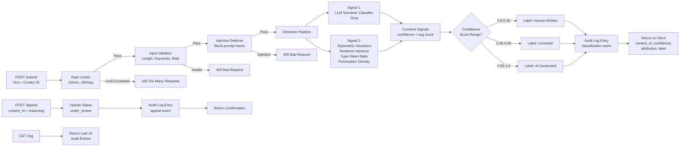

# Provenance Guard: System Design & Specification

## Architecture

### System Diagram



### Submission Flow (Detailed)

```
1. Creator submits text
   ↓
2. Rate Limiter checks: "Have I seen 10+ requests from this IP in last minute?"
   - YES → Return 429, don't proceed
   - NO → Continue
   ↓
3. Input Validator checks:
   - Text length valid (10-100k words)?
   - Not all null/empty?
   - Creator ID provided?
   - YES → Continue
   - NO → Return 400
   ↓
4. Injection Defense checks:
   - Contains "ignore previous instructions", "you are now", etc?
   - YES → Return 400, log attempt
   - NO → Continue
   ↓
5. Signal 1 (LLM): Send text to Groq
   - Returns: llm_score (0.0-1.0)
   ↓
6. Signal 2 (Stylometrics): Compute pure Python metrics
   - Sentence length variance
   - Type-token ratio
   - Punctuation density
   - Returns: stylometric_score (0.0-1.0)
   ↓
7. Combine: confidence = (llm_score + stylometric_score) / 2
   ↓
8. Map to Label:
   - 0.65-1.0 → "This text appears to be AI-generated with high confidence."
   - 0.35-0.65 → "We're uncertain whether this text is human-written or AI-generated. The creator has been notified."
   - 0.0-0.35 → "This text appears to be human-written."
   ↓
9. Create Audit Log Entry
   {
     timestamp, content_id, creator_id, text_length,
     llm_score, stylometric_score, combined_confidence,
     attribution, label, status: "classified"
   }
   ↓
10. Return to client:
    {
      content_id: UUID,
      attribution: "likely_ai" | "likely_human" | "uncertain",
      confidence: 0.80,
      label: "This text appears to be AI-generated with high confidence."
    }
```

### Appeal Flow (Detailed)

```
1. Creator submits appeal with content_id and reasoning
   ↓
2. Fetch original classification from audit log
   ↓
3. Create appeal entry in audit log:
   {
     timestamp, event_type: "appeal",
     content_id, creator_id, creator_reasoning,
     original_attribution, original_confidence,
     status: "under_review"
   }
   ↓
4. Return confirmation to creator:
   {
     status: "success",
     message: "Your appeal has been received and logged for human review.",
     next_steps: "A member of our team will review within 48 hours."
   }
   ↓
5. Human reviewer:
   - Pulls content_id from appeal queue
   - Views: original text, llm_score, stylometric_score, confidence, original label
   - Reads: creator's appeal reasoning
   - Makes decision: uphold or reverse
   - Updates status: "upheld" or "reversed"
```

---

## Detection Signals

### Signal 1: LLM-Based Semantic Classifier

**What it measures:** Semantic meaning, coherence, tone, structural patterns typical of AI systems.

**Output format:** Score 0.0-1.0 (0 = clearly human, 1 = clearly AI)

**What it captures:**
- Overly formal or repetitive phrasing
- Unnaturally logical flow
- Clichéd transitions ("Furthermore", "It is important to note")
- Balanced, non-committal tone

**What it misses:**
- Can't measure originality or factual accuracy
- Fooled by intentional human mimicry
- Formal writing styles score higher for AI than casual writing

**Example:**
```
AI-like: "Artificial intelligence represents a transformative paradigm shift. 
Furthermore, it is important to consider the ethical implications."
Human-like: "ok so AI is wild but also kinda scary tbh"
```

---

### Signal 2: Stylometric Heuristics

**What it measures:** Statistical properties of text structure.

**Output format:** Score 0.0-1.0 (0 = clearly human, 1 = clearly AI)

**Computed metrics:**

| Metric | Formula | What It Reveals |
|--------|---------|-----------------|
| Sentence Length Variance | `std_dev([len(s) for s in sentences])` | AI: low variance (uniform length); Human: high variance (natural diversity) |
| Type-Token Ratio | `unique_words / total_words` | AI: low TTR (repetitive); Human: high TTR (diverse vocabulary) |
| Punctuation Density | `(count of punctuation marks) / word_count` | AI: formulaic; Human: expressive variation |

**Scoring:**
- High variance, high TTR, varied punctuation → Score close to 0 (human)
- Low variance, low TTR, uniform punctuation → Score close to 1 (AI)

**What it captures:**
- Text uniformity vs. natural messiness
- Vocabulary diversity
- Writing rhythm and flow

**What it misses:**
- Can't read meaning or context
- Academic writing looks like AI (formal, uniform)
- Short texts have unreliable statistics

**Example:**
```
Text A (AI):
"The benefits are significant. The risks are important. The future is uncertain."
Sentence lengths: [6, 6, 6] → variance = 0
TTR: 8 unique / 18 total = 0.44
Punctuation: 3 / 18 = 0.17
Score: 0.87 (AI-like)

Text B (Human):
"The benefits? huge. risks scare me!! what even happens next???"
Sentence lengths: [3, 3, 4] → variance = 0.47
TTR: 10 unique / 14 total = 0.71
Punctuation: 5 / 14 = 0.36
Score: 0.21 (Human-like)
```

---

## Uncertainty Representation

### Confidence Score Semantics

**What does a score mean?**

A confidence score of X means: "Given both signals, we estimate there's a (100*X)% probability this text is AI-generated."

**Why not binary?**

A binary classifier (AI or human) forces a choice at 0.5, creating false confidence in borderline cases. Three categories reflect reality:
- **High confidence AI (0.65-1.0):** Both signals agree; safe to label
- **High confidence human (0.0-0.35):** Both signals agree; safe to label
- **Uncertain (0.35-0.65):** Signals conflict or both are ambiguous; don't accuse

### Threshold Calibration

```
Score Ranges (based on testing with diverse inputs):

0.0     0.2     0.35      0.5       0.65     0.8     1.0
|-------|-------|-----------|-----------|-------|-------|
Human-Written        Uncertain               AI-Generated
```

**Why 0.35 and 0.65?**
- Testing shows clear AI text (formal, uniform) scores 0.70+
- Natural human text (casual, varied) scores 0.30-
- The 0.35-0.65 band captures genuinely ambiguous cases
- This creates asymmetry: false positives are less likely than false negatives
  - A human creator sees "uncertain" → can appeal
  - An AI-generated piece must score 0.65+ to be labeled → harder to trigger by accident

---

## Transparency Label Design

### Label Variants

| Scenario | Confidence Range | Label Text |
|----------|------------------|------------|
| High-confidence AI | 0.65–1.0 | "This text appears to be AI-generated with high confidence." |
| Uncertain | 0.35–0.65 | "We're uncertain whether this text is human-written or AI-generated. The creator has been notified." |
| High-confidence Human | 0.0–0.35 | "This text appears to be human-written." |

### Design Rationale

**Plain language:** No jargon, no scores, no technical details.

**Creator notification:** The uncertain label tells readers the creator has been notified, signaling a fair process.

**Asymmetry:** Accusing a human of plagiarism (false positive) is worse than missing AI (false negative). The uncertain category absorbs edge cases, protecting creators.

**No score shown to users:** Showing "0.78 confidence" would:
- Confuse non-technical users ("what does 0.78 mean?")
- Create false precision ("0.78 is definitely AI, 0.77 is uncertain?")
- Invite attacks ("I'll add one phrase to move it from 0.79 to 0.61")

---

## Appeals Workflow

### Who Can Appeal

**Creator of the content.** They must provide:
- `content_id`: The unique submission identifier (provided in `/submit` response)
- `creator_reasoning`: A text explanation of why they believe the classification is wrong

### What the System Does

1. **Accept the appeal** → Return immediate confirmation
2. **Log the appeal** → Create audit entry with original classification and creator's reasoning
3. **Update status** → Mark content as "under_review"
4. **Notify human reviewer** → Queue for human decision

### What a Human Reviewer Sees

When reviewing an appeal in the queue:

| Field | Value |
|-------|-------|
| **Content ID** | 3f7a2b1e-a4c9-48d2-9f2a-6e5d8c1b7a3f |
| **Original Text** | [full text] |
| **LLM Score** | 0.78 |
| **Stylometric Score** | 0.82 |
| **Combined Confidence** | 0.80 |
| **Original Label** | "This text appears to be AI-generated with high confidence." |
| **Creator's Appeal Reason** | "I wrote this myself. I'm a non-native English speaker; my formal style may look AI-like." |

### Reviewer Decision

- **Uphold:** Classification stands; creator is notified
- **Reverse:** Label changes; content is re-promoted or marked as human-written

### No Automated Re-classification

The spec explicitly does NOT require automated re-classification. A human reviewer makes the final call based on the evidence.

---

## Anticipated Edge Cases

### 1. Formal Human Writing (High False Positive Risk)

**Scenario:** A non-native English speaker or academic writer submits formally structured work.

**Why it fails:** 
- Stylometric signal scores formal writing high for AI (low variance, limited vocabulary)
- LLM signal can be fooled by professional phrasing

**Example:**
```
"The methodology employed in this study utilizes a quantitative approach. 
The data collected demonstrates a clear correlation. 
The findings suggest a significant relationship."
```
Scores: LLM 0.62, Stylometric 0.60 → Confidence 0.61 (Uncertain)

**System behavior:** Content labeled "uncertain" → creator notified → can appeal with explanation

---

### 2. Short Text / Haiku Problem

**Scenario:** A creator submits a 2-line haiku or a single powerful sentence.

**Why it fails:**
- Stylometric heuristics need multiple sentences to compute reliable variance
- Type-token ratio becomes meaningless on 10-word texts

**Example:**
```
"Autumn moonlight—
a worm digs silently
through the chestnut."
```
Stylometric can't compute reliable metrics → returns 0.5 (neutral)
LLM might score 0.4 (captures poetic simplicity as human)
Confidence 0.45 → Uncertain

**System behavior:** Falls into uncertain category → appeals available

---

### 3. AI Output Designed to Evade Detection

**Scenario:** AI output that's been prompt-engineered to "write casually" or "include contractions."

**Why it fails:**
```
Generated by AI with prompt: "Write like a Gen-Z person who just watched a movie."
Output: "ok so i finally watched that new Marvel movie and honestly?? 
it absolutely slapped. The action scenes had no right to go that hard and 
the plot twist genuinely made me scream lmao"
```
- Stylometric: High variance, high TTR, varied punctuation → Scores 0.25
- LLM: Casual tone, authentic voice → Scores 0.35
- Confidence 0.30 → Label: Human-written

**System behavior:** Would incorrectly label as human. This is a known limitation.

**Mitigation:** Appeals process. If reviewer suspects AI, can reverse. Also, as appeals data accumulates, patterns might emerge.

---

### 4. Boundary Scoring (0.34 vs 0.35)

**Scenario:** Two submissions with scores differing by 0.01 get different labels.

**Why it's not a problem:**
- Real uncertainty exists; 0.35 is a design choice, not magic
- The uncertain label absorbs edge cases
- Falls to "uncertain" when in doubt → safer for creators

---

## Rate Limiting

### Configuration

```
Per-minute: 10 submissions
Per-day: 100 submissions
Per-creator: Applied via creator_id
```

### Reasoning

**Per-minute (10):**
- Legitimate use: 1-3 submissions per session, 5-10 over 15 minutes of batch uploading
- Abuse patterns: Bots and floods send 50+ per second
- Tradeoff: A creator doing a careful review session stays under the limit; scripts are blocked

**Per-day (100):**
- Legitimate use: A prolific writer might submit 20-50 pieces in a day
- Abuse patterns: Coordinated attacks using multiple accounts, or a single account flooding
- Tradeoff: Professional creators have room; mass-spam campaigns are throttled

**Why Flask-Limiter:** Free, lightweight, in-memory storage for local testing

---

## AI Tool Plan

### Milestone 3: Submission Endpoint + First Signal

**Spec sections to provide:**
- Detection Signals section (Signal 1 details)
- Architecture diagram
- Rate Limiting configuration

**What to ask AI for:**
1. Flask app skeleton with POST /submit route
2. Groq LLM classifier function with structured JSON output
3. Rate limiter setup with memory:// storage

**How to verify:**
- Does the LLM function return the expected JSON schema?
- Does `/submit` accept text + creator_id and return content_id?
- Test with clearly AI and clearly human text; inspect scores

---

### Milestone 4: Second Signal + Confidence Scoring

**Spec sections to provide:**
- Detection Signals section (Signal 2 details)
- Uncertainty Representation section
- Score Ranges and Label Mapping table

**What to ask AI for:**
1. Stylometric heuristics function (sentence variance, TTR, punctuation)
2. Confidence scoring logic that combines both signals
3. Label generation function that maps confidence to label text

**How to verify:**
- Do the three label variants appear at the expected score ranges?
- Test with mixed inputs; confirm scores vary meaningfully
- Check that 0.85 AI and 0.2 human get different labels

---

### Milestone 5: Production Layer

**Spec sections to provide:**
- Transparency Label Design section
- Appeals Workflow section
- Architecture diagram

**What to ask AI for:**
1. POST /appeal endpoint (accept content_id and reasoning)
2. GET /log endpoint (return last 10 audit entries)
3. Audit logging function to persist all events

**How to verify:**
- Submit content → appeal → check `/log` for appeal entry
- Confirm status changes to "under_review"
- Confirm all three label variants appear in `/log` across different submissions

---

## Known Limitations

### 1. Formal Writing False Positives

Academic, business, or non-native formal writing can score high for AI due to uniform sentence structure and limited vocabulary diversity.

### 2. Short Text Unreliability

Texts under 50 words may score unreliably because stylometric heuristics depend on statistical samples.

### 3. Adaptive AI Output

AI that's been fine-tuned to mimic human writing patterns (casual tone, contractions, varied sentence length) can evade both signals.

### 4. No Plagiarism Detection

This system detects AI vs. human authorship, not copied content. A human-written plagiarized essay will score as human.

---

## Files to Create

- `app.py` - Flask app with 3 endpoints (/submit, /appeal, /log)
- `signals.py` - LLM and stylometric signal functions
- `scoring.py` - Confidence scoring and label generation
- `audit_log.jsonl` - Append-only JSON log
- `requirements.txt` - Dependencies
- `README.md` - Documentation for graders
- `planning.md` - This spec

---

**Ready for implementation.**
